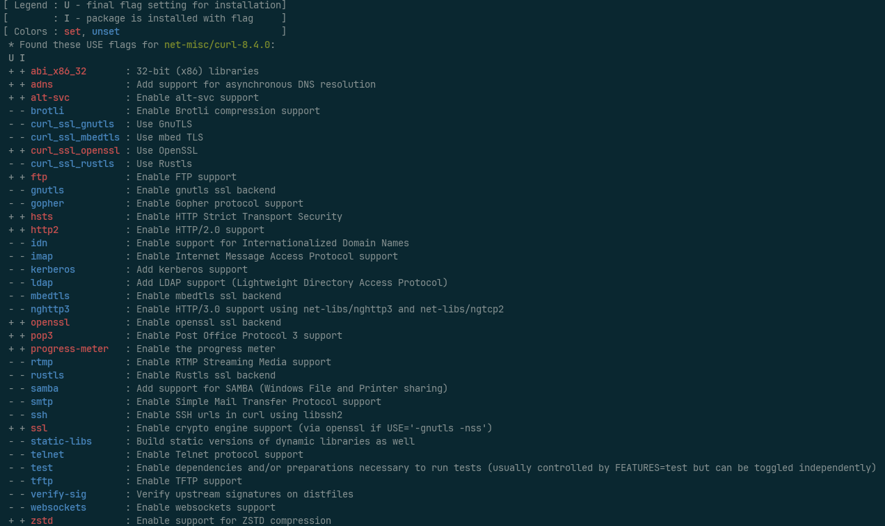

# First, a bit of history
I discovered Linux back in 2002 when I was in my second year of "Gymnasiet".
I studied "Computer Technology" and we had our own computer lab where _we_ managed all the computers and not the school's admin.
(We weren't supposed to have network access in there, but I cloned the MAC address of one of the school's regular computers and
set up one of our computers as a router. A long network cable handled the rest.)

Under the "student's choice" programme I choose a class in Linux and since none of my teachers knew anything
about Linux I essentially just got a list of everything I was required to learn and was free to learn that however I wanted.
(A lot of my classes under the student's choice programme worked this way since we only had two teachers in computer science
and one of them was a maths/physics teacher who knew a bit of C++).

I ended up learning quite a lot about Linux and installing it on quite a few of our computers for that class.
Among the things I remember was installing Debian (Potato probably) on an old Intel 80486 and manually compiling the Linux kernel (2.0 or 2.2 it seems, based on the Debian wiki) on it -
that took _days_.

I tried quite a few distributions during the next few years, some of which were:
Debian,
Mandrake Linux,
Suse Linux,
Red Hat Linux,
Slackware,
Linux from Scratch (if you can call that a distribution),
and Gentoo Linux.

And I stayed with Gentoo. For a long time.

# What is Gentoo Linux?
Gentoo Linux,
for those unfamiliar with it,
is a source-based Linux distribution which means that all packages are compiled locally at time of installation.

What this means is that Gentoo is one of the - if not _the_ - most customizable Linux distributions you'll ever encounter.

You see,
lots of open-source packages support optional features or multiple different implementations of similar functionality
(curl, for example, [supports 12 different TLS libraries](https://everything.curl.dev/build/tls) at the time of writing).
Gentoo supports selecting which technologies and features you want to support
(via something called USE-flags)
and build the packages on your system to support only those.
Among other things, this enables you to choose if you want SystemD or Gentoo's own OpenRC alternative -
yes, Gentoo officially supports two completely different init systems.

It also means that the compiler can optimize everything to _your specific_ CPU instead of producing binaries that can run on any Intel or AMD processor produced in the last 20-odd years.
In theory, this means that everything should be just a bit faster to execute. 

If you're feeling adventurous you can even enable _Link Time Optimizations_ or _Profile Guided Optimizations_ which *might* make the resulting binaries even faster at the cost of some
(a lot, really)
additional compilation time.

To summarize, Gentoo is perfect for people who want full control over the OS and who like to customize it.
That is: people like me.

# Move to Arch

Eventually, around 2015, I tired of waiting for all packages to compile and went looking for another distribution.
I had tried Debian and Ubuntu via work, 
but they've never really felt like a good fit for me.

I had read about [Arch Linux](https://archlinux.org) on the Gentoo user forums -
mostly from people switching to or from Gentoo - and decided to give it a go.

Arch Linux is about as customizable as a binary distribution can be,
and I've been really happy with Arch for almost 10 years now.
Gentoo has always been there at the back of my head though, enticing me with even more customizability.

# Gentoo goes binary!
So, shortly before Xmas I read a blog post titled [Gentoo goes Binary!](https://www.gentoo.org/news/2023/12/29/Gentoo-binary.html).
The gist of the blog post is that Gentoo now officially provides pre-compiled binary packages for a lot of the packages in the main repository.

What this means is that if you forego the customization of choosing your own USE-flags you can install packages as fast as
any binary distribution.

This immediately got me thinking about switching to Gentoo again. 
Now I could install a missing package quickly with a binary package and then compile it myself (with optimizations and _my_ USE-flags) when I have time -
or when an update is available.

# Back on Gentoo
So, last week I installed Gentoo alongside my Arch installation and tinkered with it for almost a week before I started working again yesterday.
And I can now say that after ironing out a few issues with Grub and Dracut I've been maining Gentoo for almost a week and I could not be happier.

Obviously, being me, I could not just do a regular Gentoo installation but had to combine two [profiles](https://wiki.gentoo.org/wiki/Profile) into an unoffical and unsupported _systemd-hardened-selinux_ profile.
What this means is that I'm using the hardened toolchain from the _hardened_ profile combined with the _systemd-selinux_ profile for SystemD and SELinux support -
I have yet to turn on SELinux though.

# Here to stay?
I'm very happy with Gentoo at the moment.
Everything feels familiar and I remember why I fell in love with Gentoo some 20 years ago -
the tooling is both powerful and intuitive to use,
more so than pretty much any other distribution I've used.

I'm going to evaluate Gentoo for a while,
keeping my Arch installation on disk in case I feel the need to go back
(though if I do I'm probably going to reinstall it to clean it up a bit).

