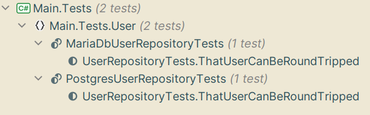

In the [previous post](/2024-03-07_csharp-code-generation-1/) I explored how to run the same tests for multiple database engines by extending Xunit.
Unfortunately that did not work,
so here we are again with a different attempt. (This one will work, promise!).

---

# Avoiding boilerplate ...

The way I intend to do this is a spin on an alternative I dismissed in the previous post:
one abstract test class with a concrete implementation per database engine.

```csharp
public abstract class UserRepositoryTests(IDatabaseEngine Engine): IAsyncLifetime
{
    public async Task InitializeAsync()
    {
        await Engine.InitializeAsync();
    }

    public async Task DisposeAsync()
    {
        await Engine.DisposeAsync();
    }
    
    // Tests go here
}

public class UserRepositoryMariaDbTests() : UserRepositoryTests(new MariaDbEngine())
{
}

public class UserRepositoryPostgresTests() : UserRepositoryTests(new PostgresEngine())
{
}
```

But instead of writing all those concrete classes, the compiler will generate them for us.

# ... by writing some boilerplate

We achieve this by implementing an incremental source generator and telling the C# compiler about it.
The compiler will then execute this during compilation to generate new classes that will be included in the compiled result.

Because of historical reasons,
there are multiple ways of generating code in C#.
We will use a _Roslyn incremental code generator_ because that seems to be the most recently introduced way.
It is also similar to how I would have done it in Java,
which should make this easier (for me).

## Setting up

Because dotnet is vehemently aggressive in caching code generators
(there is an [open issue for Visual Studio](https://github.com/dotnet/roslyn/issues/48083),
but it applies to command line tools and Rider as well),
the most straightforward way to develop a C# code generator is to test-drive it (not that I wouldn't have test-driven it regardless).
There is support for reloading Roslyn code generators in Rider,
or you can increment the version of your code generator's assembly.
Still, the latter is cumbersome and I have found that the former only sometimes works.

This means that we need two new projects alongside the main project and its unit tests:

* Codegen
* Codegen.Tests

_Codegen.Tests_ is your regular unit-test project and depends on your testing frameworks of choice - I'm using Xunit and Fluent Assertions.
The _Codegen_ project will host our code generator and as such needs the following dependencies:

```xml
<PackageReference Include="Microsoft.CodeAnalysis.Analyzers" Version="3.3.4">
    <PrivateAssets>all</PrivateAssets>
    <IncludeAssets>runtime; build; native; contentfiles; analyzers; buildtransitive</IncludeAssets>
</PackageReference>
<PackageReference Include="Microsoft.CodeAnalysis.CSharp" Version="4.3.0"/>
<PackageReference Include="Microsoft.CodeAnalysis.CSharp.Workspaces" Version="4.3.0"/>
```

If you're using Rider,
there is a convenient template for adding a source generator project to your solution that sets up the above for you.
Use the wizard to add a new project to the solution and select the Roslyn Source Generators template.

With that done,
we can move on to our code generator -
or, rather, a test.

## Writing a test

Our test class doesn't use anything special but needs some setup to run the code generation.
To keep the tests tidy,
I will break this out into a helper method.

```csharp
public class GeneratorHelpers
{

    public static IDictionary<string, string> RunSourceGenerator(IIncrementalGenerator generator, string sourceCode)
    {
        var driver = CSharpGeneratorDriver.Create(generator);

        // Create a compilation with the provided source code 
        var compilation = CSharpCompilation.Create(nameof(GeneratorHelpers),
            new[] { CSharpSyntaxTree.ParseText(sourceCode) },
            new[]
            {
                // To support 'System.Attribute' inheritance, add reference to 'System.Private.CoreLib'.
                MetadataReference.CreateFromFile(typeof(object).Assembly.Location)
            });

        // Run generators and retrieve all results.
        var runResult = driver.RunGenerators(compilation).GetRunResult();

        // Map the generated file names to their source code and return that
        return runResult.GeneratedTrees
            .ToDictionary(tree => tree.FilePath, tree => tree.GetText().ToString());
    }
}
```

What happens here is that we manually create a compilation, register our source code as a file and then capture the
generated source files at the end of the compilation so that we can make assertions about them.

We then use this helper to write our test:

```csharp
[Fact]
public void ThatOneFileIsGeneratedForEachDatabaseEngine()
{
    // Given a source code generator
    var generator = new DbTestGenerator();
    
    // And a source file that should trigger source generation
    var source = @"
    using Codegen;
    
    namespace User.Repository;
    
    [DbTest]
    public abstract class UserRepositoryTests<T>
    {
    }
    ";
    
    // When source code generation is run
    var generatedSources = GeneratorHelpers.RunSourceGenerator(generator, source);
    
    // Then a file for each database engine is generated
    generatedSources.Should().ContainKey("Codegen/Codegen.DbTestGenerator/UserRepositoryTests.generated.cs")
            .WhoseValue.Trim().Should().Be(@"
// <auto-generated/>

namespace User.Repository;
public class PostgresUserRepositoryTests(): UserRepositoryTests<PostgresEngine>(new PostgresEngine()) {}
public class MariaDbUserRepositoryTests(): UserRepositoryTests<MariaDbEngine>(new MariaDbEngine()) {}
".Trim());
 
}
```
 
The key part of this test is the source code for the generator input.
It differs from the code at the top of this post in two important ways:

1. We use a generic parameter for the database engine implementation
2. We ues the DbTest attribute on the class

The generic parameter is required if we are using Xunit collections to supply the database engine as a shared fixture.
The attribute is what is called a _marker attribute_.
We use this as a filter in our generator so that we only generate code where we should -
we don't want to create database-flavoured implementations for all abstract classes in the code base :)

## Implementing it

With the test written,
let's implement some code to satisfy it:

```csharp

[Generator]
public class DbTestGenerator: IIncrementalGenerator
{
    private const string Namespace = "Codegen";
    private const string AttributeName = "DbTestAttribute";

    private const string AttributeSourceCode = $@"
// <auto-generated/>

namespace {Namespace};

[System.AttributeUsage(System.AttributeTargets.Class)]
public class {AttributeName} : System.Attribute
{{
}}
";
    
    public void Initialize(IncrementalGeneratorInitializationContext context)
    {
        // Add the marker attribute to the compilation.
        context.RegisterPostInitializationOutput(ctx => ctx.AddSource(
            $"{AttributeName}.g.cs",
            SourceText.From(AttributeSourceCode, Encoding.UTF8)));

        // Locate and register generators for all classes marked with the marker attribute
        var testsToGenerate = context.SyntaxProvider
            .CreateSyntaxProvider(
                predicate: static (s, _) => IsClassWithAttributes(s),
                transform: static (context, _) => GetTestGenerator(context)
            )
            .Where(static c => c is not null)
            .Collect()
            .Combine(context.CompilationProvider);

        context.RegisterSourceOutput(testsToGenerate,
            static (context, pair) =>
            {
                foreach (var generator in pair.Left)
                {
                    generator.Generate(context, pair.Right);
                }
            });
    }

```

A lot is going on here,
so let's break it down.

First,
we register the marker attribute so that it is available to our test classes.
We do this by registering a source file and its contents (the const string).

To avoid inspecting everything,
we use a simple filter that locates all classes in the compilation with at least one attribute.
For each class lotcated,
we ensure it is marked with the correct attribute and create a _Generator_ (more on that later).

```csharp
    private static bool IsClassWithAttributes(SyntaxNode syntaxNode)
    {
        return syntaxNode is ClassDeclarationSyntax classNode
           && classNode.AttributeLists
               .SelectMany(list => list.Attributes).Any();
    }

    private static Generator? GetTestGenerator(GeneratorSyntaxContext context)
    {
        var classNode = context.Node as ClassDeclarationSyntax; // We know this won't fail
        
        var hasAttribute = classNode!.AttributeLists.SelectMany(list => list.Attributes)
            .Select(attribute => context.SemanticModel.GetSymbolInfo(attribute).Symbol)
            .OfType<IMethodSymbol>()
            .Any(symbol => symbol.ContainingType.ToDisplayString().Equals($"{Namespace}.{AttributeName}"));

        return hasAttribute ? new Generator(context) : null;
    }
```

Finally, let's look at the Generator class:

```csharp

    private class Generator(GeneratorSyntaxContext gsc)
    {
        private readonly ClassDeclarationSyntax classNode = (ClassDeclarationSyntax)gsc.Node;
        public void Generate(SourceProductionContext spc, Compilation compilation)
        {
            var semanticModel = compilation.GetSemanticModel(classNode.SyntaxTree);
            if (semanticModel.GetDeclaredSymbol(classNode) is not INamedTypeSymbol classSymbol)
            {
                return;
            }
            
            var @namespace = classSymbol.ContainingNamespace.ToDisplayString();
            var className = classNode.Identifier.Text;
            GenerateCode(spc, @namespace, className, ["Postgres", "MariaDb"]);
        }

        private void GenerateCode(SourceProductionContext spc, string @namespace, string className, IEnumerable<string> providers)
        {
            var code = $@"
// <auto-generated/>

namespace {@namespace};
";
            foreach (var provider in providers)
            {
                code += $"public class {provider}{className}(): {className}<{provider}Engine>(new {provider}Engine()) {{}}\n";
            }
            
            spc.AddSource($"{className}.generated.cs", code);
        }
    }


```

What we do here is get some metadata about the test class -
name and namespace -
and use that to generate a new class using string interpolation.
We then add that to the compilation under a unique name
(first-hand experience taught me that non-unique names will cause a silent failure).

We can now run our test, and it will pass.

## Using it

The last step is to add the code generator to our unit-test project and let it generate the test classes for us.
We do this by adding a dependency on the code generator project,
telling MSBuild that it is a code generator.

```xml
<ProjectReference
            Include="..\Codegen\Codegen.csproj"
            OutputItemType="Analyzer"
            ReferenceOutputAssembly="false"
    />
```

Now, when we compile our tests,
the generator will generate our database flavours for us:



Adding support for a new database is as easy as implementing a new `IDbEngine` and adding it to the array in our generator:

```diff
diff --git a/Codegen.Tests/DbTestGeneratorTests.cs b/Codegen.Tests/DbTestGeneratorTests.cs
index 6c843da..365b806 100644
--- a/Codegen.Tests/DbTestGeneratorTests.cs
+++ b/Codegen.Tests/DbTestGeneratorTests.cs
@@ -38,6 +38,7 @@ public class DbTestGeneratorTests
 namespace User.Repository;
 public class PostgresUserRepositoryTests(): UserRepositoryTests<PostgresEngine>(new PostgresEngine()) {}
 public class MariaDbUserRepositoryTests(): UserRepositoryTests<MariaDbEngine>(new MariaDbEngine()) {}
+public class SqliteUserRepositoryTests(): UserRepositoryTests<SqliteEngine>(new SqliteEngine()) {}
 ".Trim());
     }
 }
diff --git a/Codegen/DbTestGenerator.cs b/Codegen/DbTestGenerator.cs
index d189496..c01d53b 100644
--- a/Codegen/DbTestGenerator.cs
+++ b/Codegen/DbTestGenerator.cs
@@ -100,7 +100,7 @@ namespace {Namespace}

             var @namespace = classSymbol.ContainingNamespace.ToDisplayString();
             var className = classNode.Identifier.Text;
-            GenerateCode(spc, @namespace, className, ["Postgres", "MariaDb"]);
+            GenerateCode(spc, @namespace, className, ["Postgres", "MariaDb", "Sqlite"]);
         }

         private void GenerateCode(SourceProductionContext spc, string @namespace, string className, IEnumerable<string> providers)
```


All that remains is to implement the database engines and the user repository.
I leave that as an exercise for the reader.
You can also check out a complete example with passing tests over on [my GitHub](https://github.com/raniz85/examples_csharp-codegen).

