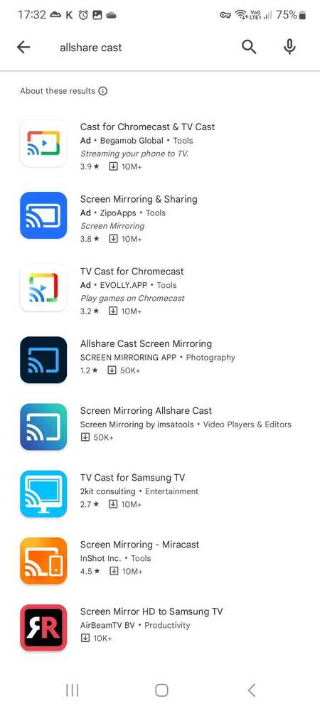

I just got back to my hotel room after some time in the sauna,
and before I went into the shower I thought I'd put on some [music](https://open.spotify.com/playlist/37i9dQZF1DZ06evO30B6ms?si=aae427d65e3f4696).
---

Now, neither my phone nor my laptop have very impressive speakers,
there is a TV in the room however so I thought that surely I can make my phone play music through the TVs speakers,
right? **right?**

As it turns out: no. 

I have a Samsung phone, the TV is a Samsung TV, that's supposed to work.

The input selection menu in the TV has an item for "Screen Share" -
I really only wand *sound* share, but screen sharing will work I guess.

When you select the *Screen Share* option a message is displayed telling you to open the *AllShare Cast* app.
There is no QR code or link to any app stores,
so I guess you're just supposed to search whatever store is on your phone for "AllShare Cast" and install that.

Here's what that search turns up on Google's Play Store:

None of these are from Samsung or anything else that looks trustworthy at all -
they all look rather fishy.
If I were to installshare-play-storeall or open any of these apps I fear that they would at best try to flood my screen with apps and at
worst utilize some vulnerability to spy on me or steal my secrets.

Now, I know that Samsung usually does things via their *SmartThings* app,
so instead I fired that up and started looking around for a way to share my screen.

I found no such option, I could however add a new device, so I tried that.

Lo and behold, the TV shows up as an available device,
but when I add it I'm told that that didn't work because of my VPN connection.

I guess I can live without a VPN connection while showering,
so I turn WireGuard off and try again -
no dice, not even an error message.
The TV just tells me that Screen Sharing has ended and returns to showing regular TV channels instead.

I tried 3 more times before giving up and settling with the lousy speaker in my phone.

A few weeks ago, I was away skiing in Lindvallen with my family.
We rented a cabin for a week and had a terrific time -
the kids even learned to ski a little!

Now, the same problem presented itself when we wanted to watch a movie one night.
The setup was about the same that time: Samsung TV and Samsung Phone.

The TV told me that I had to add it to my phone using the Samsung SmartThings app
(correct instructions that time at least!). When doing so I got a prompt on the TV that I would now take over ownership
of the TV from <some danish-sounding email address>. 
I continued, had to select a room where the TV was placed,
and eventually the TV showed up in my SmartThings app as a device.

I could now show a video on my phone and the TV at the same time -
with the limitation that anything I did on my phone showed on the TV too,
so no reading feeds while the kids were watching movies as we can at home with the Chromecast
(yes, a Chromecast is far from a *dumb* device, but it only does one thing - and I think it usually does that thing quite well).

I want to share a success story as well. That time we were at [Ästad Vingård](https://astadvingard.se/),
and like today I wanted some music while showering and getting ready for dinner.

The major difference between the TV in that room and the TV in my current room was that the TV at Ästad was *pretty dumb*.

There were no *ScreenShare* options anywhere but the only things I could select were physical inputs and *BlueTooth*.

Now, for all criticism you can throw at BlueTooth it has two things going for it:

1. It is rather ubiquitous
2. It tends to just work

And that's exactly what happened that time.
My phone connected on the first attempt and I could play my music using the TV's speakers about 30 seconds after turning
it on.

So, where am I going with all this?

Well, I mostly just wanted to whine a bit about how smart things tend to not be smart at all.
I do have a point though,
and that is that I think that supporting standards is generally better than trying to come up with your own thing -
especially when that thing requires users to install yet another app that'll take up a lot of room on their phone.

On an ending note I discovered while adding the TV in my hotel room that I'm still the "owner" of the TV in the cabin.
And, yes, I can remotely control a TV in a cabin almost 600 km away from my current location.
I'll let you decide how **smart** or useful that functionality is.