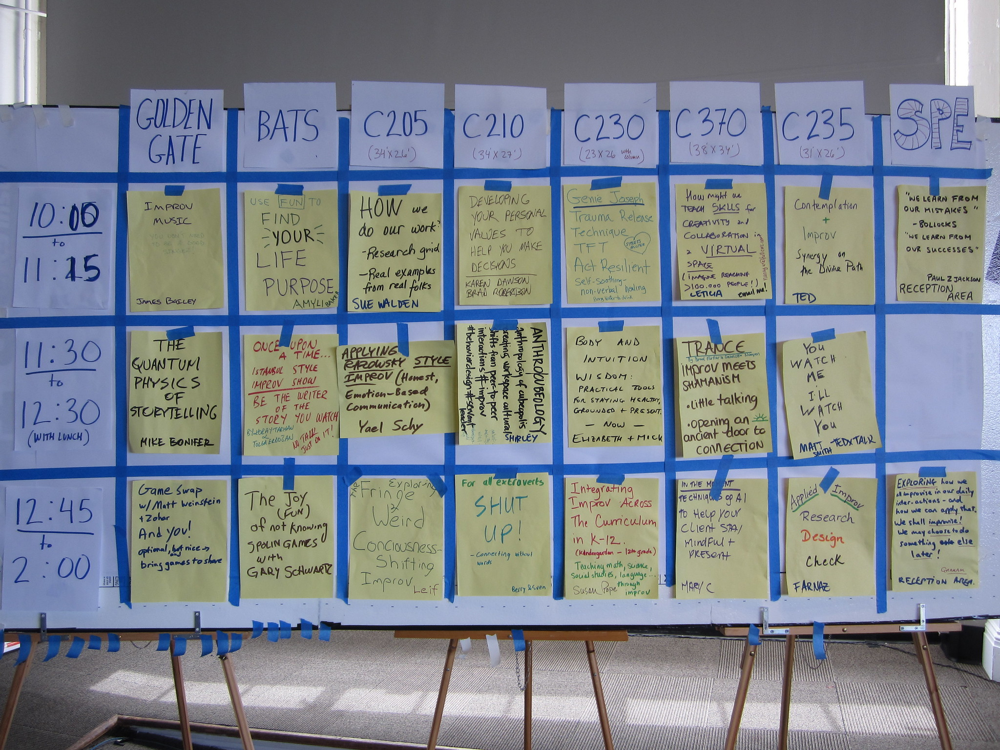

The first time I attended an Open Space session, I had no idea what it was.

I had recently started at factor10 when we hosted two half-days of Open Space.
When our CEO told me there would be no agenda, I was confused:
We were to spend about 8 hours with 15 people,
and there was no agenda at all?

It all worked out in the end,
and the glory of Open Space quickly became apparent to me.

---

# Open Space
Open Space is a self-organising conference format that centres around the participants and what they want to discuss.

A scheduling table with time slots (sessions) in rows and locations around the venue in columns is used to facilitate the event.
Each cell in the table represents a topic at a time and place during the event.

## Marketplace

To fill the cells in the scheduling table with topics, we conduct something called _Marketplace_.
Marketplace occurs before and between each session,
with the first instance usually allocated more time than the others.

At the start of the first Marketplace,
everyone gets time to come up with topics for discussion and write them down on sticky notes.
We then take turns putting our stickies on the schedule and quickly explain the topic.

Where the author places the stickies differ from event to event.
Sometimes, they are placed directly in a free cell;
other times,
we put them in an area outside the schedule called a _parking space_.
To decide which topics go from the parking space to cells,
we usually conduct dot-voting, where everyone puts dots on the stickies they are the most interested in.
Everyone gets a limited number of votes.

After each time slot,
we return to the Marketplace and make sure we have topics for the next time slot.
If anyone has come up with a new topic,
they write it on a sticky note and put it on the board.

_An example schedule from an Open Space event. Credit: [Nancy White via Flickr, CC-BY-NC-SA 2.0](https://www.flickr.com/photos/91506145@N00/8025115191)_

## The sessions

Once the first Marketplace is over,
everyone selects a topic from the current session and moves to its designated location,

where the discussions take place.
No one actively facilitates the discussions;
usually, whoever introduced the topic starts the conversation, and it continues naturally from there.

Once the time for the session is up,
we regather at the Marketplace to prepare for the next session.
This continues until the event is over.

## Rules
Open Space generally has few rules, and they differ among organisers.
Most rules ensure discussions happen in a psychologically safe environment and everyone gets as much as possible out of the sessions.
Apart from treating each other with respect,
a common rule is not to discuss what others share outside the event.

Whenever I organise Open Space events, I usually introduce four principles:
* Whoever comes are the right people. I.e. those who show up are the ones interested in the topic, providing optimal conditions for engagement.
* When it starts is the right time. We're always flexible with time. We keep the sessions to the allotted time slots, but the schedule can be dynamic if we fail.
* Whatever conversation occurs is the one that was supposed to, regardless of the original topic.
* If you find yourself in a discussion where you are neither learning nor contributing, you are always free to move to another group (also known as the law of two feet).

# What I like about Open Space

What strikes me every time I attend an Open Space event is the quality of the discussions.
I always come away inspired and full of new ideas.

The format,
where everyone collectively decides on the topics,
means that every discussion has the most favourable conditions for engagement. 
The focus on a psychologically safe environment hopefully also means that everyone are comfortable opening up and joining the discussions.